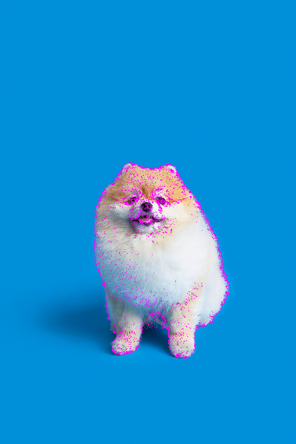
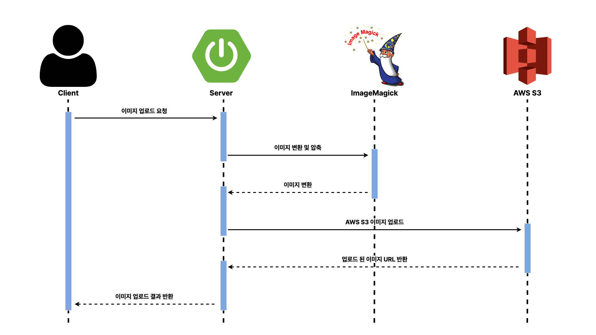

# What's Your Plan! - Image Server Project

<div align="center">


해당 서버는 이미지를 업로드 및 확장자 변환, 압축을 담당합니다.

</div>

## Quick Starter

해당 서버를 동작하기 위해서는 반드시 [Docker](https://www.docker.com/)가 필요합니다.

> 해당 서버는 [ImageMagick](https://imagemagick.org/)를 사용하여 이미지를 변환하고 있는데 도커 이미지를 빌드할 때 프로그램을 설치하여 동작합니다.

```shell
#!/bin/bash

sh ./script/quick-starter.sh
```

## 주요 기능

이미지를 변환 및 압축하는 이유는 AWS S3에 이미지를 업로드하여 사용하는데 이미지의 크기가 크다면 이미지 응답 속도가 느려지며 AWS 비용도 많이 나오게 됩니다.
이를 해결하기 위해서 서버에 들어오는 모든 이미지를 `.avif`확장자로 변환 및 압축하여 이미지를 저장합니다.

`.avif`를 선택한 이유는 데이터 통신량이 많은 기업들을 중심으로 고효율 AV1 코덱을 개발하였고 이를 확장하여 2019년에 나온 최신 포맷입니다.
이는 전통적인 이미지 포맷을 대체하기 출시되었으며 다른 포맷에 비해 뛰어난 압축 효율을 보이며 사용권에서 벗어나므로 택하였습니다.

### ImageMagick

<div align="center">


</div>

이미지를 변환 및 압축하기 위한 도구로 [ImageMagick](https://imagemagick.org/)을 선택하였습니다. 자유롭게 사용할 수 있으며, 설치만 하면 명령어를 통해 간단하게 사용할 수 있습니다.

> 이미지매직은 그래픽 이미지를 새로 만들거나, 고치는 데 사용되는 자유-오픈 소스 소프트웨어이다. 이미지 매직은 대부분의 이미지 형식을 읽고, 변환하거나 쓸 수 있다.
> 출처: [위키백과](https://ko.wikipedia.org/wiki/%EC%9D%B4%EB%AF%B8%EC%A7%80%EB%A7%A4%EC%A7%81)

### `.jpg` VS `.avif`

|                  original jpg image                  |                   convert jpg image                   |                   convert avif image                    |
|:----------------------------------------------------:|:-----------------------------------------------------:|:-------------------------------------------------------:|
|  |  |  |
|                     287KB (100%)                     |                     37KB (12.9%)                      |                       24KB (8.4%)                       |

기본적으로 이미지의 큰 화질 차이는 없지만 이미지의 용량에서 차이점이 보입니다.
퀄리티를 50으로 조정한 뒤 변환한 결과 `jpg to jpg`는 기존 이미지에 비해 37KB(12.9%)의 용량을 차지하지만 `jpg to avif`는 24KB(8.4%)로 jpg보다 더욱 뛰어난
압축률을 보입니다.

원본 이미지와 `.avif` 이미지의 차이점을 하이라이트로 비교해본 결과 큰 차이가 없다는 것을 확인할 수 있습니다.



> 이미지 비교는 [diffchecker](https://www.diffchecker.com/image-compare/) 에서 진행하였습니다.

### 4K image

추가로 4K 이미지를 사용하여 비교하였습니다.

|                     original 4k image                     |                     convert jpg image                      |                     convert avif image                     |
|:---------------------------------------------------------:|:----------------------------------------------------------:|:----------------------------------------------------------:|
|  |  |  |
|                       3.4MB (100%)                        |                       1.1MB (32.6%)                        |                       773KB (22.2%)                        |

## 이미지 업로드 프로세스

